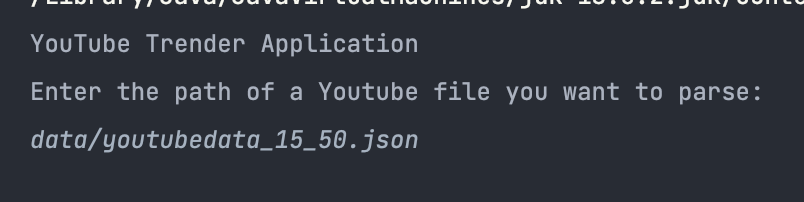
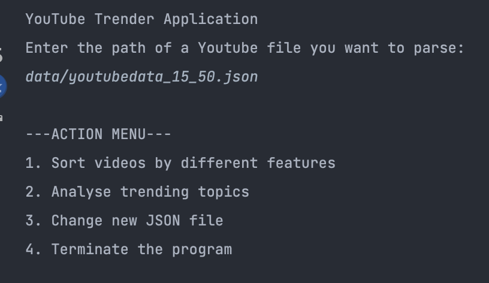
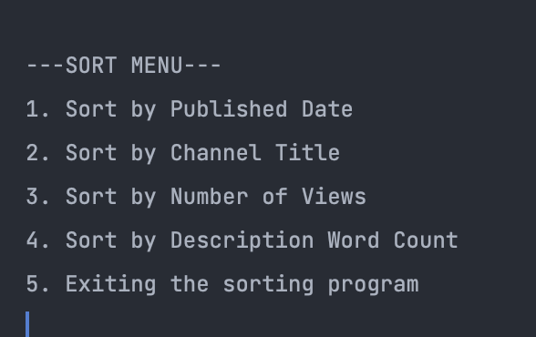
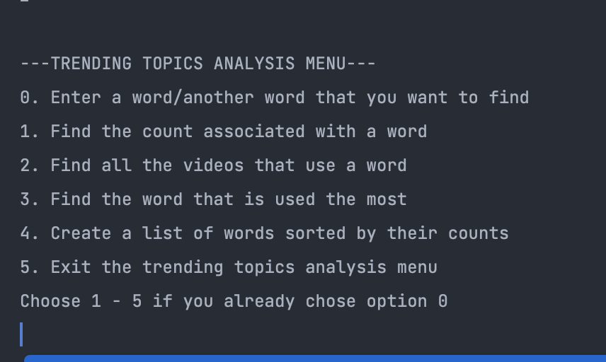

# YoutubeTrender

YouTube is a global video-sharing website headquartered in San Bruno, California, United States. The
site allows users to upload, view, rate, share, and comment on videos.
1 Available content includes
video clips, TV clips, music videos, movie trailers, and other content such as video blogging, short
original videos, and educational videos. User can also add a title and description to the videos and
by examining the contents of and detecting which words appear frequently across titles and
descriptions we can detect “trending topics.” See below for more information on YouTube and the
YouTube Data API that generate the list of videos used in this project:

YouTube: https://www.youtube.com/yt/about/en-GB/  
Wikipedia on Youtube: https://en.wikipedia.org/wiki/YouTube  
YouTube Data API: https://developers.google.com/youtube/v3/getting-started
YouTube Data API for listing videos: https://developers.google.com/youtube/v3/docs/videos/list

### This project is to develop a command line application that can detect the YouTube Trending Topics.

1. Parse a YouTube video data string in into a YouTube video object
   

You can generate your own youtube data json file and input the path in the CLI

2. Sort Video objects by different features (e.g. title, channel title, views, date, etc.)
   

3. After you enter the file path correctly, there is an action menu that you can choose whichever option you would like
For example, in this case, you chose the option 1. There will be a sorting menu pop up

   

4. Index the list of videos for word usage, aka “Trending Topics”
Here is the menu option if you chose option 2 from the action menu

   
